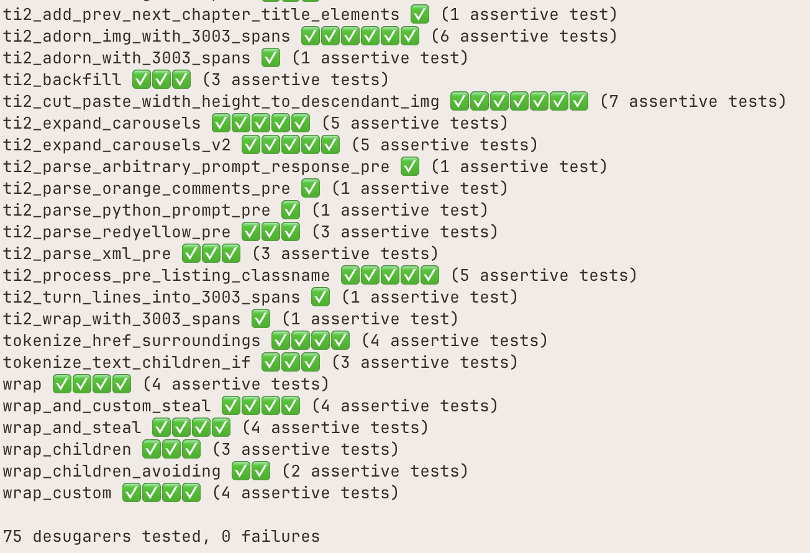

# Installation

## 1. [Gleam Install](https://gleam.run/getting-started/installing)

## 2. Clone repos

Clone [wly](https://github.com/vistuleB/wly) and this repo. The two repos must be put as sibling folders of a parent folder or else the local paths in `renderer/gleam.toml` and `renderer/manifest.toml` need to be edited. (For the latter, erase the relevant entries and let Gleam re-generate them.)

## 3. 'wly' test

Run `gleam run -m desugarers` inside `desugaring` folder of `wly` repo.

Various output should come out like this:



## 4. Running the project

Run `gleam run` or `gleam run -- --verbose` inside of this repo's `renderer` folder.

Run `gleam run -- --help` for some other options.

## 5. Running the localhost

1. `npm install` in this repo's home folder
2. `npm run dev`
3. try `http://localhost:3000`

## 6. Restricting the source

For VSCode usage, install the [Writerly](https://marketplace.visualstudio.com/items?itemName=TabbyNotes.writerly-vscode-extension) extension.

Add key-value pair `aaa=bbb` to some `|> Section` elements in `src/content/ch1.wly` and to some `|> Section` of `src/content/bt1.wly`.

Run `gleam run -- --only ch1 aaa=bbb` in the `renderer/` folder. Then:

- only Chapter 1 should appear (or use `bt1` for bootcamp 1, etc)
- within Chapter 1, only those elements that have key-value pair `aaa=bbb` should appear

## 7. Go-to-source tooltips (`--local` mode)

Modify the previous command by running `gleam run -- --only ch1 aaa=bbb --local` in the `renderer` folder.

Note: Go-to-source tooltips will only work if `code` has been bound to open the default code editor (e.g., VSCode) in the terminal.

Note: Go-to-source tooltips produce voluminous output, so it's always recommended to combine that option with some `--only` restriction. 

## 8. Editing the root `__parent.wly` file

`src/content/__parent.wly` offers another means of controlling which chapters are included, which exercises are included in which chapter, and the ordering of exercises within a chapter. This file is also a good place to test VSCode's "Go To Definition" command on '`>>`' handle references.

## 8. VSCode `tasks.json` file

A sample command that can be inserted in `.vscode/tasks.json`
file to work with the project, assuming that
the root folder of the repo has been set up
as the root folder of a VSCode workspace ("File -> Save Workspace as..."):

```json
{
  "version": "2.0.0",
  "tasks": [
    {
      "label": "gleam run today's special",
      "type": "shell",
      "command": "gleam",
      "group": {
        "kind": "build",
        "glob": "**/*.wly",
        "isDefault": true,
      },
      "presentation": {
        "reveal": "never",
        "panel": "shared",
      },
      "problemMatcher": [],
      "runOptions": {
        "reevaluateOnRerun": true,
        "instanceLimit": 1,
      },
      "options": {
        "cwd": "${workspaceFolder}/renderer"
      },
      "args": [ "run", "--", "--only", "ch5", "ch4", "content=selection", "work=ing", "--local", "--warnings"]
      // "args": [ "run", "--", "--only", "ch5", "content=selection", "work=ing", "--warnings"]
      // "args": [ "run", "--", "--only", "ch5", "ch3", "ch4"]
    },
  ]
}
```

Note that `content=selection` is included in the `--only` arguments so that various "control nodes" of `src/content/__parent.wly` are not filtered out, but selected instead. On the other `work=ing` is to select the current "transient zone of interest" for the author or the developer.